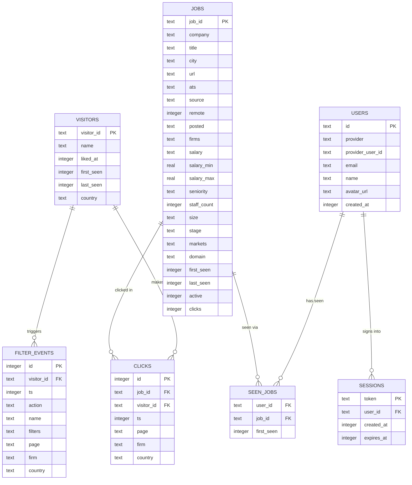

# Database schema — ER diagram

Generated from [`schema.sql`](schema.sql).

## Notes

- `CLICKS`→`JOBS`/`VISITORS` and `SEEN_JOBS`→`JOBS` are not enforced with `REFERENCES` in
  the SQL — only `sessions.user_id` and `seen_jobs.user_id` actually declare a foreign key.
  The relationships above reflect intent, not a constraint SQLite is enforcing.
- `USERS` (real OAuth accounts) and `VISITORS` (anonymous per-browser IDs) are deliberately
  separate and never merged.
- `FILTER_EVENTS` carries a `visitor_id` but is explicitly documented in the schema as
  aggregate-only, not a per-user trail.
