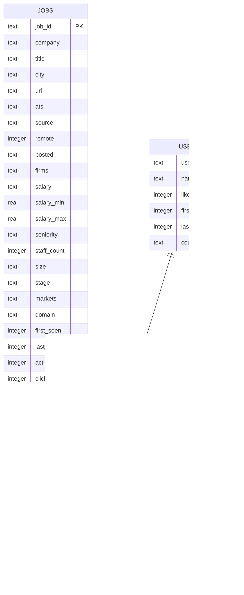

# Database schema — ER diagram

Generated from [`schema.sql`](schema.sql).

## Notes

- There is no sign-in. A `users.user_id` is a UUID the browser mints for itself — no
  email, no password, no IP. `name` is optional, whatever someone typed when asked.
- No relationship above is enforced with `REFERENCES`; SQLite is not constraining them.
  The diagram reflects intent.
- `filter_events` carries a `user_id` but the schema documents it as aggregate product
  feedback, not a per-person trail.
